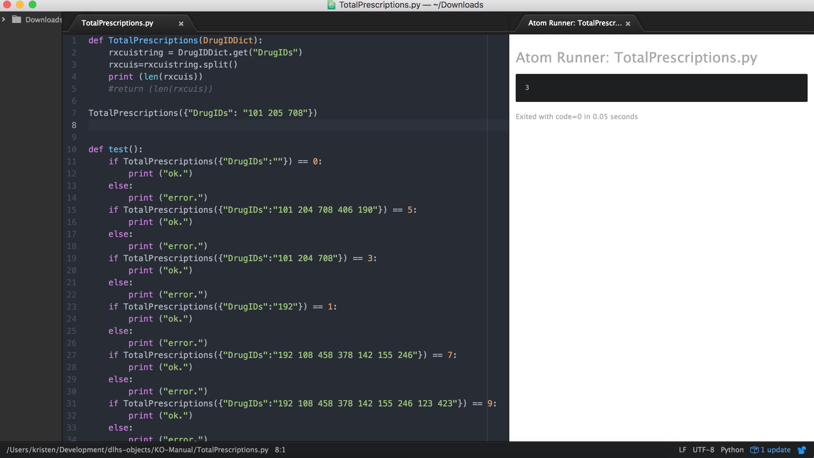

# Additional Resources

While creating the initial knowledge objects, we gathered a list of applications that could be helpful for current and future knowledge object authors. These applications are applicable for those who are unsure where to start, or are looking for a more efficient, alternative way to create knowledge objects.

- Atom (https://atom.io)
Atom is a helpful text editor that contains built in packages to run code locally. When developing, Atom allows you to test your code within the interface as a means of making the process more efficient. Atom also contains a variety of built in packages, making it easy for users to customize Atom to their needs (https://atom.io/packages). Continuing with totalPrescriptions, below is an example of calling the function locally, and outputting to the shell. However, in order to see output in the shell, print must be used instead of return.

- Sublime Text (www.sublimetext.com)
	A text editor with built in packages to run code. Can also create custom build tools

- Postman (https://www.getpostman.com) 

